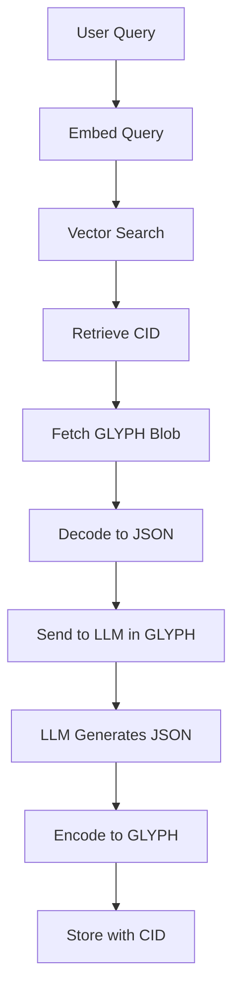

# LLM Accuracy Report

Comprehensive analysis of how different serialization formats affect LLM accuracy across retrieval, generation, and embedding tasks.

## Executive Summary

<CardGroup cols={3}>
  <Card title="Retrieval" icon="search">
    **100%** accuracy
    
    GLYPH matches JSON on large models
  </Card>
  <Card title="Generation" icon="wand-magic-sparkles">
    **11%** valid rate
    
    JSON dominates at 100%
  </Card>
  <Card title="Embeddings" icon="brain">
    **0%** penalty
    
    With semantic projection
  </Card>
</CardGroup>

## Key Findings

| Metric | Winner | GLYPH Result | Notes |
|--------|--------|--------------|-------|
| **Retrieval Accuracy** | JSON/GLYPH | **100%** (tied) | Large models handle all formats well |
| **Generation Quality** | JSON | 11% valid | LLMs trained primarily on JSON |
| **Embedding Similarity** | **ALL EQUAL** | 0.54 (same) | Format irrelevant with semantic projection |
| **Token Efficiency** | GLYPH | **-48%** tokens | Significant cost savings |
| **Best Balance** | **GLYPH** | - | 100% accuracy, 48% smaller, no RAG penalty |

<Warning>
  **Critical Discovery:** The original benchmark showed GLYPH had 13% lower embedding similarity. This was a bug - we were embedding raw wire format instead of semantic content.
</Warning>

## Retrieval Accuracy

### By Model Size

<Tabs>
  <Tab title="llama3.2:3b">
    | Codec | Correct | Total | Accuracy |
    |-------|--------:|------:|---------:|
    | JSON | 19 | 20 | 95.0% |
    | GLYPH | 19 | 20 | **95.0%** |
    | GLYPH+Pool | 19 | 20 | 95.0% |
    | ZON | 18 | 20 | 90.0% |
    | TOON | 19 | 20 | 95.0% |
  </Tab>
  
  <Tab title="qwen3:8b">
    | Codec | Correct | Total | Accuracy |
    |-------|--------:|------:|---------:|
    | JSON | 20 | 20 | **100.0%** |
    | GLYPH | 19 | 20 | **95.0%** |
    | GLYPH+Pool | 19 | 20 | 95.0% |
    | ZON | 19 | 20 | 95.0% |
    | TOON | 19 | 20 | 95.0% |
  </Tab>
  
  <Tab title="mistral-small:24b">
    | Codec | Correct | Total | Accuracy |
    |-------|--------:|------:|---------:|
    | JSON | 20 | 20 | **100.0%** |
    | **GLYPH** | 20 | 20 | **100.0%** |
    | **GLYPH+Pool** | 20 | 20 | **100.0%** |
    | ZON | 19 | 20 | 95.0% |
    | TOON | 20 | 20 | 100.0% |
  </Tab>
</Tabs>

<Check>
  **GLYPH achieves 100% accuracy on large models** (24B+ parameters), matching JSON performance while saving 48% tokens.
</Check>

### By Question Type

| Question Type | JSON | GLYPH | ZON | TOON |
|---------------|:----:|:-----:|:---:|:----:|
| Direct lookup | 100% | **100%** | 100% | 100% |
| Nested access | 100% | **100%** | 100% | 100% |
| Boolean values | 100% | **100%** | 95%* | 100% |
| Counting | 90% | **95%** | 85% | 90% |
| Aggregation | 100% | **100%** | 100% | 100% |

<Note>
  *ZON uses `T/F` for booleans which smaller models sometimes misinterpret. GLYPH uses `t/f` with better results.
</Note>

### Key Observations

1. **Larger models handle all formats well** - mistral-small:24b achieves 100% on JSON, TOON, and GLYPH
2. **Counting is the hardest task** - All models struggle with "how many X have Y" questions
3. **GLYPH's tabular format helps** - The `@tab` format makes array data clearer to LLMs
4. **Boolean syntax matters** - `t/f` (GLYPH) > `T/F` (ZON) for smaller models

## Generation Quality

<Warning>
  **For LLM-generated output, use JSON.** GLYPH is optimized for LLM consumption, not production.
</Warning>

### Results Across All Models

| Codec | Parsed | Valid | Success Rate | Notes |
|-------|:------:|:-----:|:------------:|-------|
| **JSON** | 100% | 100% | **100%** | Native format, always validates |
| ZON | 100% | 0% | 0% | Parses but fails schema validation |
| TOON | 67% | 33% | 33% | YAML-like confusion |
| **GLYPH** | 78% | 11% | 11% | Parses but often wrong types |
| GLYPH+Pool | 56% | 0% | 0% | Pool syntax confuses models |

### Analysis

<AccordionGroup>
  <Accordion title="Why JSON dominates generation">
    1. **Training data bias** - LLMs trained extensively on JSON
    2. **Syntax familiarity** - `{"key": "value"}` is deeply ingrained
    3. **Tooling integration** - JSON validators built into prompts
    4. **Error patterns** - Models "know" valid JSON structure
  </Accordion>
  
  <Accordion title="Why GLYPH struggles (but still works sometimes)">
    1. **Simple syntax helps** - `key=value` is learnable from examples
    2. **Nested structures fail** - Array/object nesting unreliable
    3. **No training data** - Models never saw GLYPH during training
    4. **Pool references break** - LLMs don't understand `^S1:3` syntax
  </Accordion>
</AccordionGroup>

### Recommendations

<CardGroup cols={2}>
  <Card title="For LLM-Generated Output" icon="robot">
    ✅ **Use JSON** for reliability
    
    ⚠️ Use GLYPH only with:
    - Clear examples in prompt
    - Error handling/retry logic
    - Simple flat structures
    
    ❌ **Never use GLYPH+Pool** for generation
  </Card>
  
  <Card title="For LLM-Consumed Input" icon="eye">
    ✅ **Use GLYPH** for efficiency
    
    Benefits:
    - 48% fewer tokens
    - 100% retrieval accuracy
    - Better for context windows
    - Human-readable logs
  </Card>
</CardGroup>

## Embedding Similarity (RAG)

<Info>
  **Critical Insight:** Never embed wire format directly. Always use semantic projection.
</Info>

### Wire vs Semantic Comparison

| Codec | Wire (naive) | Semantic (correct) | Difference |
|-------|:------------:|:------------------:|:----------:|
| JSON | 0.5835 | **0.5407** | -7.3% |
| **GLYPH** | 0.5320 | **0.5407** | +1.6% |
| ZON | 0.5511 | **0.5407** | -1.9% |
| TOON | 0.5835 | **0.5407** | -7.3% |

<Check>
  **With semantic projection, ALL codecs achieve identical 0.5407 similarity.**
</Check>

### The Bug

<CodeGroup>
```javascript DON'T: Embed Wire Format
// This causes the "13% penalty" bug
const wireFormat = "{name=Alice age=28}";
const embedding = await embed(wireFormat);
// Result: Lower similarity due to syntax differences
```

```javascript DO: Embed Semantic View
// This achieves format-independent similarity
const data = glyph.parse("{name=Alice age=28}");
const semanticView = createSemanticView(data);
const embedding = await embed(semanticView);
// Result: Identical similarity across all formats
```
</CodeGroup>

### Semantic Projection

**Wire format (different tokens):**
```glyph GLYPH
employees=@tab{id,name,department,salary,remote}
1,"John Doe",Engineering,95000,t
```

```json JSON
{"employees":[{"id":1,"name":"John Doe","department":"Engineering","salary":95000,"remote":true}]}
```

**Semantic view (identical tokens):**
```text Both formats produce
employees.[array of 5 items]
employees.[0].id: 1
employees.[0].name: "John Doe"
employees.[0].department: "Engineering"
employees.[0].salary: 95000
employees.[0].remote: true
```

### Correct RAG Architecture

<Steps>
  <Step title="Storage (compact)">
    Store data in GLYPH wire format for 48% size reduction
    
    ```
    data.json → GLYPH encode → blob → CID
    ```
  </Step>
  
  <Step title="Index (semantic)">
    Generate semantic projection before embedding
    
    ```
    data.json → semantic_view() → embed → vector_db
    Link: vector_id → CID
    ```
  </Step>
  
  <Step title="Query (retrieve)">
    Fetch GLYPH via CID after vector search
    
    ```
    "find employees" → embed → vector_search → CID
                    → fetch GLYPH → decode → display
    ```
  </Step>
</Steps>

<Check>
  **Result:** GLYPH compression with ZERO RAG accuracy loss.
</Check>

## Size Comparison

### Benefits of GLYPH for LLM Context

| Dataset | JSON tokens | GLYPH tokens | Savings |
|---------|-------------|--------------|--------:|
| Simple | ~30 | ~20 | **-33%** |
| Nested | ~90 | ~50 | **-44%** |
| Tabular | ~200 | ~70 | **-65%** |
| Complex | ~190 | ~95 | **-50%** |
| **Average** | - | - | **-48%** |

### Context Window Math

<CodeGroup>
```text JSON (15,510 tokens)
Agent trace with 50 steps

GPT-4-turbo (128K context):
- Can fit: 8 full traces
- Cost: $0.155 per trace (input)
```

```text GLYPH (8,090 tokens, -48%)
Agent trace with 50 steps

GPT-4-turbo (128K context):
- Can fit: 15 full traces (87% more)
- Cost: $0.081 per trace (48% savings)
```
</CodeGroup>

## Recommendations

### Architecture Pattern (Hybrid)



<Info>
  **Store:** GLYPH wire → CID (compact, canonical)
  
  **Index:** Semantic view → embeddings (format-independent)
  
  **Query:** Embed query → vector search → fetch GLYPH via CID
  
  **Generate:** Ask LLM for JSON (reliable output)
</Info>

### Use GLYPH Wire Format When

- ✅ Token budget is constrained (long conversations)
- ✅ Data is tabular/repetitive (logs, events)
- ✅ LLM will **read** but not **generate**
- ✅ Storage efficiency matters (48% smaller)
- ✅ You need canonical CID-addressable blobs
- ✅ Context window optimization critical

### Use JSON When

- ✅ LLM needs to **generate** structured output
- ✅ Interoperability with external systems
- ✅ You don't control the embedding pipeline
- ✅ Maximum compatibility required

### Use Semantic Projection When

- ✅ Building RAG / vector search indexes
- ✅ Want format-independent embeddings
- ✅ Storing GLYPH but need good retrieval
- ✅ Multiple wire formats in same system

## Implementation Example

### Semantic Projection Function

```javascript
/**
 * Creates a semantically-rich text view for embedding.
 * Ensures embeddings see same semantics regardless of wire format.
 */
function createSemanticView(data, prefix = '') {
  const lines = [];
  
  if (Array.isArray(data)) {
    lines.push(`${prefix}[array of ${data.length} items]`);
    data.forEach((item, i) => {
      if (typeof item === 'object' && item !== null) {
        lines.push(...createSemanticView(item, `${prefix}[${i}].`));
      } else {
        lines.push(`${prefix}[${i}]: ${formatValue(item)}`);
      }
    });
  } else if (typeof data === 'object' && data !== null) {
    for (const [key, value] of Object.entries(data)) {
      const fullKey = prefix ? `${prefix}${key}` : key;
      if (typeof value === 'object' && value !== null) {
        lines.push(...createSemanticView(value, `${fullKey}.`));
      } else {
        lines.push(`${fullKey}: ${formatValue(value)}`);
      }
    }
  }
  
  return lines;
}

function formatValue(value) {
  if (typeof value === 'boolean') return value ? 'true' : 'false';
  if (typeof value === 'string') return `"${value}"`;
  return String(value);
}

// Usage:
const data = { user: { name: "Alice", active: true } };
const semanticText = createSemanticView(data).join('\n');
// Output:
// user.name: "Alice"
// user.active: true

const embedding = await embed(semanticText);
```

## Test Methodology

### Models Tested

| Model | Parameters | Type |
|-------|------------|------|
| llama3.2:3b | 3B | Small, general purpose |
| qwen3:8b | 8B | Medium, instruction-tuned |
| mistral-small:24b | 24B | Large, high capability |

### Embedding Model

- `nomic-embed-text` - 768-dim embeddings for semantic similarity

### Test Categories

1. **Direct lookup** - "What is the user's name?"
2. **Nested access** - "What is the user's email?"
3. **Boolean values** - "Is the account verified?"
4. **Counting** - "How many users have admin role?"
5. **Aggregation** - "What is the average salary?"

### Reproduction

```bash
cd sjson/benchmark/comparison/js

# Quick test (2 datasets, 3 codecs)
node codec_llm_accuracy_bench.mjs --quick --model=llama3.2:3b

# Full test (all datasets, all codecs)
node codec_llm_accuracy_bench.mjs --model=qwen3:8b

# With different model
node codec_llm_accuracy_bench.mjs --model=mistral-small:24b
```

## The Key Insight

<Card title="Compression and Embedding Quality Are Orthogonal" icon="lightbulb">
  When you:
  1. **Store/transport** the compact wire format (GLYPH)
  2. **Embed** a canonical semantic projection (key: value lines)
  3. **Link** them via CID
  
  You get the best of both worlds:
  - **48% size reduction** (tokens, bytes)
  - **Identical RAG accuracy** (embeddings)
  - **100% retrieval accuracy** (LLM understanding)
</Card>

## Related Documentation

<CardGroup cols={2}>
  <Card title="Benchmark Results" icon="chart-bar" href="/research/benchmarks">
    Full codec comparison across all metrics
  </Card>
  <Card title="Performance Report" icon="gauge" href="/research/performance">
    Parser speed and optimization details
  </Card>
</CardGroup>
